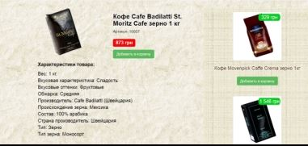
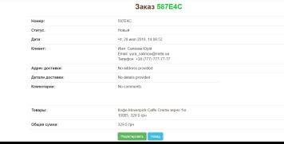

"[Prem Coffee](http://coffee.tk)" is the online shop of a beautiful and aromatic coffee for You and friends. Here You can buy coffee beans, ground coffee, coffee in mono doses and in capsules. Coffee is a drink of the real programmer. :-)

**Used Technologies**: Java EE, Maven, Servlets, Spring Framework (IoC, MVC, Data, Security), JPA / Hibernate, MySQL, JSP / JSTL, Bootstrap, CSS, JS, Junit, Mockito, Jacoco.

Shop work can be divided into 3 parts: _for clients_, _for administrator_ and _for managers_.

<h4>For clients</h4>

Clients can only navigate on the main pages of the website, view products and make orders. 

  

<h4>For Managers</h4>

Managers can navigate on the main pages of the site and the pages intended for managers ([.../manager](http://coffee.tk/manager)). Managers have the access to edit information about the orders after consultation with the customer, view information about the site personnel to enable communication with colleagues.

  

<h4>For Administrator</h4>

Administrator can navigate on all the pages of the site, in particular through the pages of managers and pages intended for the administrator ([.../admin](http://coffee.tk/admin)). Administrator can add, edit, and delete information about the products, categories and managers. All information is stored in the database.

  

To access the pages of managers and administrators need to be authorized ([.../login](http://coffee.tk/login)). Without the authorization of access is denied. After ordering by client, managers receive a message on e-mail with order details and client contact information.

[_**Prem Prakash**_](https://www.linkedin.com/in/yurii-salimov)

